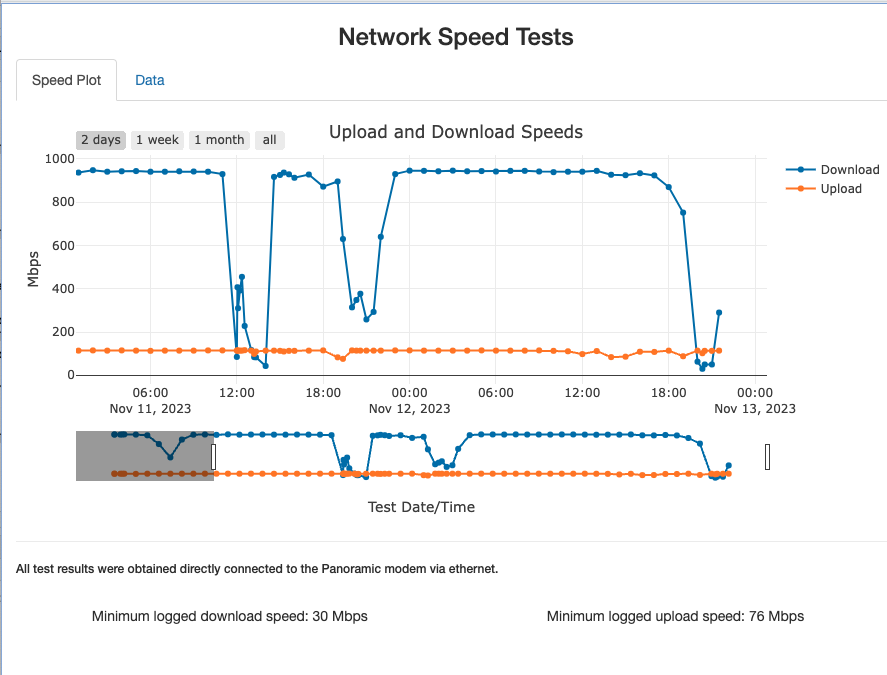

# Network Speed Test Result app

This is a R/Shiny applicaton that takes the output generated from Ookla's command line speedtest <https://www.speedtest.net/apps/cli> and displays both upload and download speeds over time. I have been having network issues of late from my ISP and this little app allows me to look and see upload and download speeds at a glance.

There is a [sample bash script](utils/speedtest_job.sh) in the utils folder that will create a row in a csv file. You can run this script from cron at your desired frequency. I run this hourly with a few on the half hour at known peak times of performance degradation. This can't really be run on a continuous basis; hence you may miss some of the peaks and valleys of performance.

Note that you must run the speedtest command once by hand with --output-header set and then add the header for the date column by hand in that created file.

After run this from cron at the desired frequency.

The Shiny app expects the file location to be a shared file (I use Dropbox). It will download that into a temp file. I have the app deployed on [shinyapps.io](https://shinyapps.io).

There are two simple pages: 
* Speed plot - showing the plot. You can hover over the datapoints to get their values/date. The min upload and download speed are also noted.

-   Data - allows the viewing of the data along with the URL of the speedtest run. You can also download the data from here.

